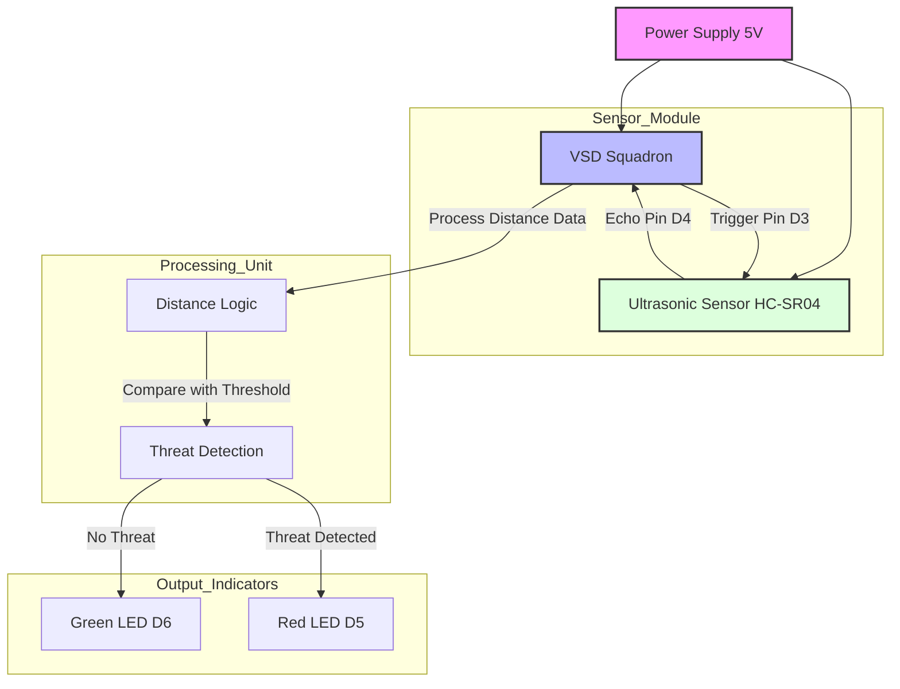

# Samsung RISC-V Internship by VSD

---

## Personal Information  
**Name**: Karthik MN  
**Email**: karthikmn199@gmail.com  
**College**: National Institute of Engineering, ECE 5th Semester  

---

## Task 1 - Compilation Differences Between -O1 and -Ofast

### -O1 Optimization
- Prioritizes readable and understandable code with basic optimizations.
- Larger number of instructions due to minimal optimization.
- Keeps intermediate calculations and variables in memory.
- Detailed code flow makes it easier to follow and debug.

### -Ofast Optimization
- Aggressive optimization for maximum performance, potentially sacrificing strict adherence to standards.
- Fewer instructions as redundant operations are removed.
- More compact code layout with streamlined computations.
- Reduced intermediate steps, making the code harder to debug but faster to execute.

---

## Task 2 - Optimization Flags -O1 and -Ofast Performance

### -O1 Optimization
- Takes longer route with more detailed steps.  
- Starts at memory address `0x10184`.  
- More instructions and steps visible.  
- Easier to debug and follow the program flow.  
- Good for development and testing phase.  

### -Ofast Optimization
- Takes shorter, faster route.  
- Starts at memory address `0x100b0`.  
- Fewer instructions to do the same task.  
- Harder to debug but better performance.  
- Perfect for final production code.  

### Main Differences
- Memory addresses are organized differently.  
- `-Ofast` uses fewer registers more efficiently.  
- Instruction count is lower in `-Ofast`.  
- Both reach the same result (e.g., 120) but through different paths.  

### Memory & Performance
- `-Ofast` has a more compact code layout.  
- Better register management in `-Ofast`.  
- Less memory usage in the `-Ofast` version.  
- Faster execution due to optimization.  

### Trade-offs
- **O1**: Better debugging vs slower performance.  
- **Ofast**: Better performance vs harder debugging.  
- `-O1` shows a clear instruction flow.  
- `-Ofast` focuses on speed over readability.  

---

## Task 3 - Instruction Set Description

### List of Commands

1. **`lui`**  
   - **Description**: Load Upper Immediate. Loads a 20-bit immediate into the upper 20 bits of a register.  
   - **Usage**: Used for addressing and initializing high-order bits.  

2. **`addi`**  
   - **Description**: Add Immediate. Adds a sign-extended 12-bit immediate to a register value.  
   - **Usage**: Used for constant additions.  

3. **`li`**  
   - **Description**: Load Immediate. Loads a constant value into a register.  
   - **Usage**: Simplifies loading constants.  

4. **`sd`**  
   - **Description**: Store Doubleword. Stores a 64-bit value from a register to memory.  
   - **Usage**: Transfers data from register to memory.  

5. **`jal`**  
   - **Description**: Jump and Link. Used to jump to a target address and save the return address in a register.  
   - **Usage**: Primarily for function calls.  

6. **`ret`**  
   - **Description**: Return. Returns control to the address stored in the return address register.  
   - **Usage**: Used at the end of a function.  

7. **`ld`**  
   - **Description**: Load Doubleword. Loads a 64-bit value from memory into a register.  
   - **Usage**: Transfers data from memory to register.  

8. **`auipc`**  
   - **Description**: Add Upper Immediate to PC. Adds a 20-bit upper immediate to the program counter.  
   - **Usage**: Often used for position-independent code.  

9. **`beqz`**  
   - **Description**: Branch if Equal to Zero. Branches to a target address if the register value is zero.  
   - **Usage**: Implements conditional branching.  

10. **`j`**  
    - **Description**: Unconditional Jump. Jumps directly to a target address.  
    - **Usage**: Used for unconditional control flow changes.  

11. **`sub`**  
    - **Description**: Subtract. Subtracts one register value from another.  
    - **Usage**: Used for arithmetic operations.  

12. **`lbu`**  
    - **Description**: Load Byte Unsigned. Loads an unsigned byte from memory into a register.  
    - **Usage**: For working with byte-sized data.  

13. **`bnez`**  
    - **Description**: Branch if Not Equal to Zero. Branches if the register value is not zero.  
    - **Usage**: Implements conditional branching.  

14. **`sb`**  
    - **Description**: Store Byte. Stores the lower 8 bits of a register to memory.  
    - **Usage**: Transfers byte-sized data to memory.  

15. **`jr`**  
    - **Description**: Jump Register. Jumps to the address contained in a register.  
    - **Usage**: Used for indirect control flow.  

16. **`mv`**  
    - **Description**: Move. Copies the value from one register to another.  
    - **Usage**: For data transfer between registers.  

17. **`jalr`**  
    - **Description**: Jump and Link Register. Jumps to an address in a register and saves the return address.  
    - **Usage**: Primarily for indirect function calls.  

---

## Task 4: Functional Simulation of RISC-V Core

### Objective
Perform a functional simulation of the RISC-V Core Verilog netlist using a comprehensive testbench.

### Environment Setup
- **Simulation Tools**: 
  - Icarus Verilog (iverilog)
  - GTKWave
- **Platform**: Linux/Ubuntu

### Simulation Procedure
1. **File Preparation**
   - Downloaded RISC-V Core Verilog Netlist
   - Obtained corresponding Testbench

2. **Compilation Commands**
   ```bash
   iverilog -o simulation netlist.v testbench.v
   ./simulation
   gtkwave waveform.vcd
   ```

---

## Task 5: Radar System for Threat Detection

### Project Overview
A surveillance system utilizing an ultrasonic sensor (HC-SR04) and VSD Squadron to detect potential threats within a specified range. The system provides visual feedback through LED indicators for threat detection status.

### Block Diagram


### Components Required
- Ultrasonic Sensor (HC-SR04)
- VSD Squadron
- Red LED (Threat indicator)
- Green LED (Clear indicator)
- Resistors
- Jumper Wires
- Breadboard
- Power Supply (5V)
- Arduino/MCU (Optional)
- Power Source (Battery or USB)

### Circuit Connections
#### Ultrasonic Sensor (HC-SR04) Pinout
- VCC → VIN (Power)
- Trig → D3 (Trigger pin)
- Echo → D4 (Echo signal pin)
- GND → GND (Ground)

#### LED Connections
- **Red LED (Detection Alert)**
  - Anode (+) → D5
  - Cathode (-) → GND (via resistor)
- **Green LED (No Obstacle)**
  - Anode (+) → D6
  - Cathode (-) → GND (via resistor)

### Pin Details

| Component | Pin Type | Pin Name | Connection Details |
|-----------|----------|----------|-------------------|
| Ultrasonic Sensor | VCC | VIN | Powered by VSD Squadron VIN pin |
| Ultrasonic Sensor | Trig | D3 | Trigger pin for sensor measurement |
| Ultrasonic Sensor | Echo | D4 | Echo pin for distance reading |
| Red LED | Anode | D5 | Digital pin with resistor |
| Green LED | Anode | D6 | Digital pin with resistor |
| Red LED | Cathode | GND | Ground through resistor |
| Green LED | Cathode | GND | Ground through resistor |

### Functionality
- Ultrasonic sensor emits pulse via Trig pin
- Echo pin receives reflected pulse for distance calculation
- Red LED activates when object detected within threshold
- Green LED indicates clear status when no threats detected

### Usage Instructions
1. Assemble circuit components according to connection diagram
2. Upload program code to VSD Squadron/microcontroller
3. Power up the system
4. System automatically begins threat detection:
   - Red LED: Threat detected within range
   - Green LED: No threats detected

### Reference
Refer to the Smart Door Example for guidance on sensor integration and VSD Squadron configuration for real-time object detection systems.
